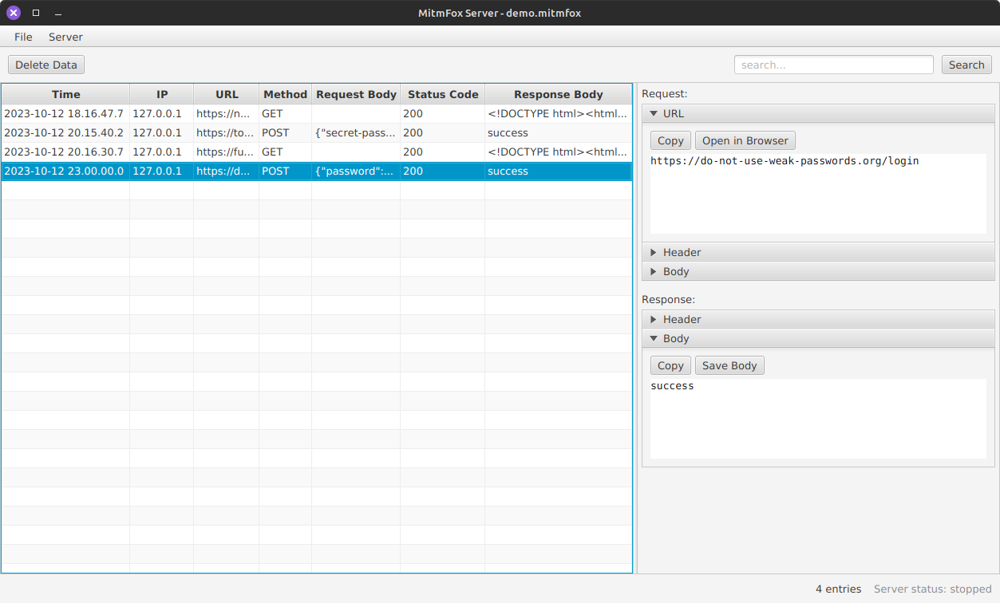

# MitmFox Server

> Analyse network traffic of MitmFox Client systems.

## What is MitmFox?

MitmFox ([Man-in-the-middle](https://en.wikipedia.org/wiki/Man-in-the-middle_attack)-Fox) is a system for developers
and testers to analyze [HTTP](https://en.wikipedia.org/wiki/HTTP) requests and server responses from client machines.
Developers can identify problems that occurred during testing on one or multiple clients without requiring physical
access to the client machines.

## How does it work?

The client machine runs a Python script (MitmFox Client) that intercepts network data via a
[proxy](https://en.wikipedia.org/wiki/Proxy_server) server and sends requests and responses to a MitmFox Server.

### How does a Proxy work?

Let's illustrate the basics of a "man-in-the-middle" with a short story:

You want to write a letter to Alice with the top-secret recipe of your grandma's brownies.
There is just one catch: you and Alice do not know each other's physical addresses. However, you both share a mutual
friend, Mallory, who is aware of both addresses.

So Mallory provides you with Alice's address: _Long Street 276, 1234 City, Wonderland_ and you send your letter to
that address.

What happens next? **Mallory** unfolds the letter. Mallory? Why not Alice? What happened?

The address _Long Street 276, 1234 City, Wonderland_ was not Alice's but Mallory's. So Mallory opens it, reads it and
may even modify it. Now, because he knows Alice's real address, he sends the letter away to Alice's real address.
Since neither Alice nor you know each other's addresses, you have to trust Mallory. Alice and you will never find out
about Mallory's actions.

A proxy does a very similar thing too (maybe a little bit more complicated).
To summarise that in one sentence: your computer believes it is communicating with the server and the server believes
it is communicating with the client. In reality, both are communicating with a proxy.

## MitmFox Server

The server software receives data from MitmFox clients and presents that data in a table. You can view the visited
URLs, response headers, body, and request headers.

Main features of MitmFox Server:

- data saving
- data search capabilities
- start/stop server functionality

## Demo Data

You can find demo data with some (more or less) realistic examples [here](/demo-data/demo.mitmfox).

## Installation and First Steps

You need to compile MitmFox Server yourself, but it does not take long (1 to 3 minutes).

Replace `mvn` with `./mvnw` (Unix systems) or `mvnw.cmd` (Windows) if you do not have Maven installed.

1. ensure your firewall allows incoming traffic
2. clone this repository `git clone https://www.github.com/gregor-gottschewski/mitmfox-server`
3. `cd mitmfox-server`
4. `mvn clean package`
5. `mvn install`
6. `mvn javafx:run`
7. start the server: _Server > Start_ and specify a port number
8. launch MitmFox Client on your client machine (which can be the same machine)

## Disclaimer and Licence

**This application was developed for testing, development, and educational purposes ONLY.**

> MIT License
>
> Copyright (c) 2023 Gregor Gottschewski
>
> Permission is hereby granted, free of charge, to any person obtaining a copy
> of this software and associated documentation files (the "Software"), to deal
> in the Software without restriction, including without limitation the rights
> to use, copy, modify, merge, publish, distribute, sublicense, and/or sell
> copies of the Software, and to permit persons to whom the Software is
> furnished to do so, subject to the following conditions:
>
> The above copyright notice and this permission notice shall be included in all
> copies or substantial portions of the Software.
>
> THE SOFTWARE IS PROVIDED "AS IS", WITHOUT WARRANTY OF ANY KIND, EXPRESS OR
> IMPLIED, INCLUDING BUT NOT LIMITED TO THE WARRANTIES OF MERCHANTABILITY,
> FITNESS FOR A PARTICULAR PURPOSE AND NONINFRINGEMENT. IN NO EVENT SHALL THE
> AUTHORS OR COPYRIGHT HOLDERS BE LIABLE FOR ANY CLAIM, DAMAGES OR OTHER
> LIABILITY, WHETHER IN AN ACTION OF CONTRACT, TORT OR OTHERWISE, ARISING FROM,
> OUT OF OR IN CONNECTION WITH THE SOFTWARE OR THE USE OR OTHER DEALINGS IN THE
> SOFTWARE.
